# EDTS Data Engineer Technical Test - CSV Data Cleansing

## 1. Short Explanation About the Script
Proyek ini merupakan solusi *data pipeline* untuk melakukan pembersihan data (*cleansing*), deduplikasi, dan pemuatan data dari format CSV mentah ke dalam *database* relasional. Pipeline ini dibangun menggunakan Python (dengan library `pandas` dan `psycopg2`) dan diorkestrasi dalam lingkungan Docker.

Berikut adalah penjelasan alur pemrosesan skrip `main.py` berdasarkan fungsi-fungsi utamanya:

```python
read_csv(file_path)
```
Melakukan ingesti data dari file CSV mentah ke dalam *pandas DataFrame*, dilengkapi dengan penanganan *exception* jika file sumber tidak ditemukan atau gagal dibaca.

```python
split_duplicates(df)
```
Melakukan deduplikasi *record* berdasarkan identifier kolom `ids`. Baris dengan kemunculan pertama diklasifikasikan sebagai data bersih (*clean*), sedangkan duplikasinya diisolasi menjadi data *reject*.

```python
transform_data(df)
```
Melakukan standardisasi skema data, meliputi:
- *Parsing* kolom `dates` ke dalam format standar `YYYY-MM-DD`.
- Transformasi string pada kolom `names` menjadi huruf kapital (*uppercase*).
- *Type-casting* pada metrik numerik (`monthly_listeners`, `popularity`, `followers`, `num_releases`, `num_tracks`) menjadi tipe `integer`, serta mengonversi *null values* menjadi `0`.
- Pembentukan *array/list* Python dari data string yang dipisahkan oleh koma untuk kolom `genres` dan `feat_track_ids`.

```python
list_to_pg_array(lst)
prep_df_db(df)
```
Memformat *array/list* dari Python agar kompatibel dengan sintaks DDL *array literal* PostgreSQL (contoh format target: `{"item1", "item2"}`), lalu mengaplikasikannya ke dalam *DataFrame* sebelum di-*insert*.

```python
get_db_connection()
create_tables(conn)
```
Menginisiasi koneksi ke PostgreSQL menggunakan variabel *environment* dan secara otomatis mengeksekusi skrip `ddl.sql` untuk pembentukan tabel target (`data` dan `data_reject`) jika belum eksis di dalam database.

```python
insert_dataframe(conn, df, table_name)
```
Melakukan *bulk insert* ke tabel PostgreSQL `data` dan `data_reject` menggunakan fungsi `execute_values` dari `psycopg2.extras` untuk meminimalkan latensi I/O ke database.

```python
export_clean_to_json(df_clean_transformed, timestamp)
export_reject_to_csv(df_reject_raw, timestamp)
```
Mengekspor luaran fisik dengan format penamaan berbasis *timestamp*:
- Mengonversi *DataFrame* bersih menjadi *nested JSON* yang menyertakan informasi `row_count` dan *array* data aktual.
- Mengekspor *DataFrame reject* kembali ke format CSV tanpa melakukan mutasi pada struktur kolom aslinya.

---

## 2. How to Run the Script
Pastikan **Docker** dan **Docker Compose** telah beroperasi pada environment Anda. Anda tidak perlu menginstal dependensi Python atau PostgreSQL secara manual.

**Langkah Eksekusi:**
1. **Persiapan Data Sumber (Aktual)**: Pastikan Anda menempatkan file data *assessment* asli `scrap.csv` ke dalam direktori `./source/` (bukan menggunakan data dari folder *example*).
2. **Pembersihan Environment Sebelumnya**: Jika sebelumnya Anda pernah menjalankan data *example*, bersihkan *database* terlebih dahulu agar data tidak tercampur:
```bash
docker compose down -v
```
3. **Konfigurasi Environment**: Salin dan sesuaikan konfigurasi *environment*:
```bash
cp .env.example .env
```
4. **Build dan Jalankan Eksekusi Utama (`main.py`)**: 
   Perintah ini akan membangun *image* dan **secara otomatis menjalankan skrip `main.py`** di dalam container:
```bash
docker compose up --build
```
   *(Visualisasi proses build container)*:
   <p align="center">
     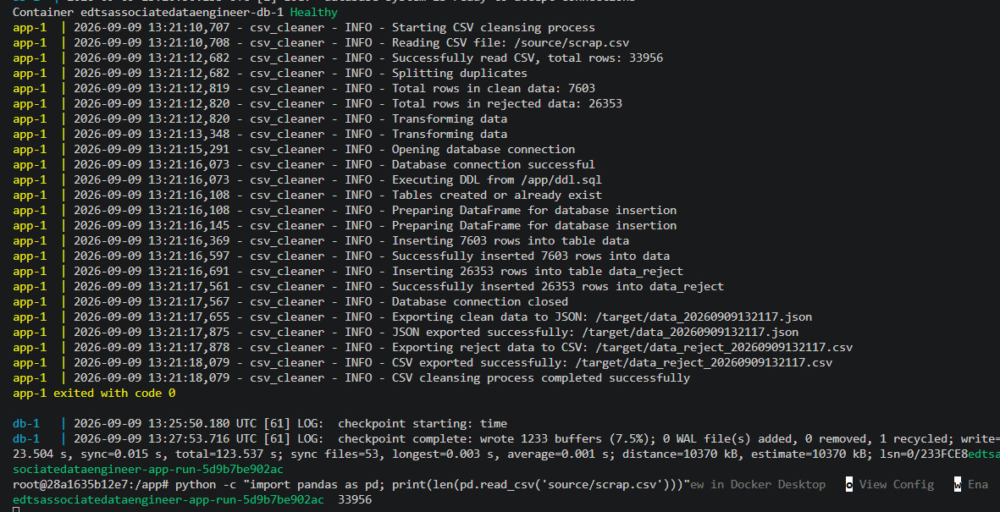
   </p>

---

## 3. Pipeline Execution Results (Main Script Logs)
Berikut adalah dokumentasi visual hasil eksekusi dari fungsi-fungsi utama pada `main.py` saat memproses data aktual dari folder `/source`:

* **1. Splitting Data (Deduplikasi ID)**:
  <p align="center">
    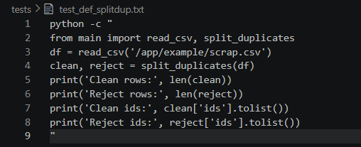
  </p>

* **2. Data Transformation (Standardisasi Skema)**:
  <p align="center">
    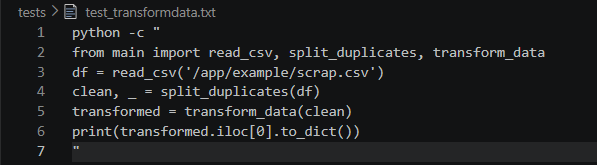
  </p>

* **3. Database Preload Preparation**:
  <p align="center">
    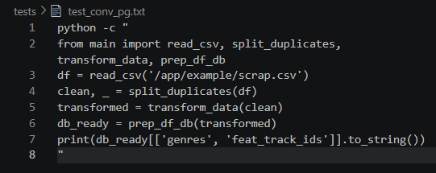
  </p>

* **4. Bulk Insert to PostgreSQL (Clean Data)**:
  <p align="center">
    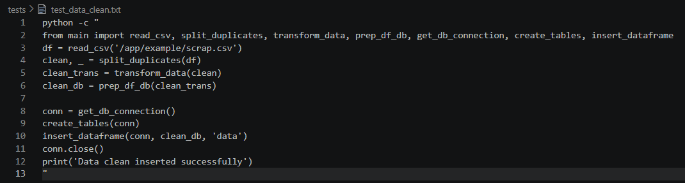
  </p>

* **5. Bulk Insert to PostgreSQL (Reject Data)**:
  <p align="center">
    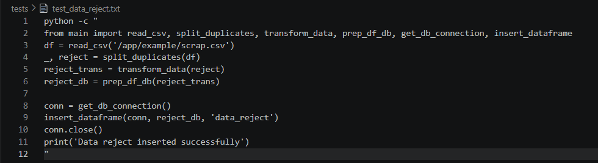
  </p>

* **6. Exporting Clean Data to JSON & Reject to CSV**:
  <p align="center">
    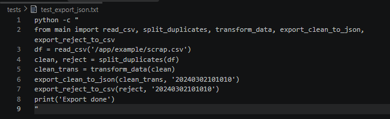
  </p>

---

## 4. Expected Result and Validation
Setelah *container* menyelesaikan pekerjaannya, pipeline akan memproduksi luaran fisik dan data terstruktur pada *database*.

**A. File Fisik (di dalam direktori `./target/`)**:
- `data_YYYYMMDDHHMMSS.json`: Data hasil pembersihan dan transformasi.
- `data_reject_YYYYMMDDHHMMSS.csv`: Data duplikat (*rejected records*).

**B. Integritas Database & Hasil Row Count**:
Untuk memvalidasi bahwa data berhasil disimpan ke dalam PostgreSQL, berikut adalah tangkapan layar hasil pengecekan jumlah baris (*row count*) pada tabel `data` dan `data_reject`:

* **Total Baris Data Bersih (`data`)**: 7,603 rows
  <p align="center">
    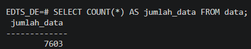
  </p>

* **Total Baris Data Duplikat (`data_reject`)**: 26,353 rows
  <p align="center">
    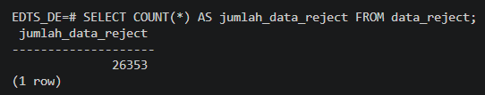
  </p>

---

## 5. Unit Testing Execution & Documentation
Pipeline ini dilengkapi pengujian mandiri menggunakan `pytest` untuk memvalidasi fungsi-fungsi logikal secara terisolasi. 

Untuk menjalankan unit test di dalam container:
```bash
docker compose run --rm app pytest tests/test_main.py -v
```

Berikut adalah dokumentasi visual untuk setiap pengujian unit (*Unit Test Cases*):
* **Test Read Data**:
  <p align="center">
    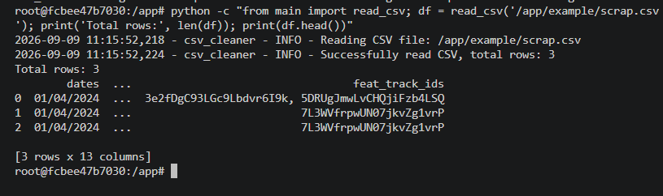
  </p>

* **Test Splitting Duplicates**:
  <p align="center">
    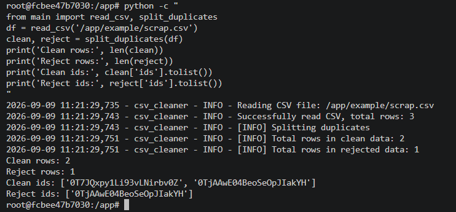
  </p>

* **Test Data Transformation**:
  <p align="center">
    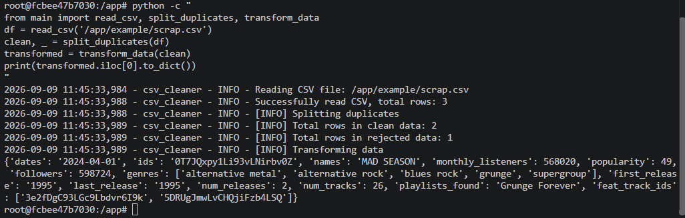
  </p>

* **Test Preload Preparation**:
  <p align="center">
    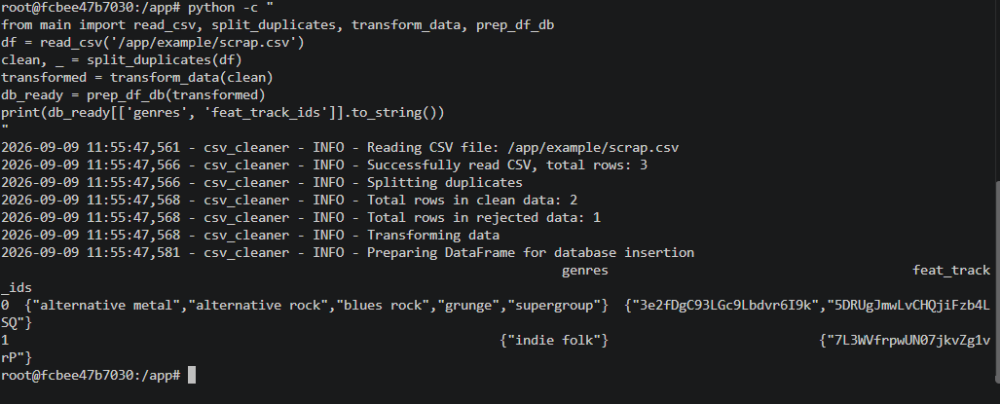
  </p>

* **Test Database Insert (Clean)**:
  <p align="center">
    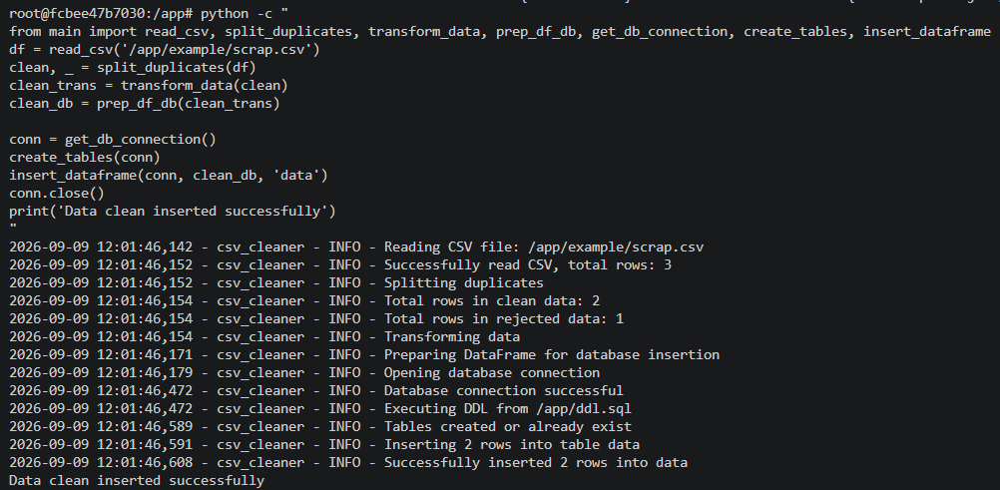
  </p>

* **Test Database Insert (Reject)**:
  <p align="center">
    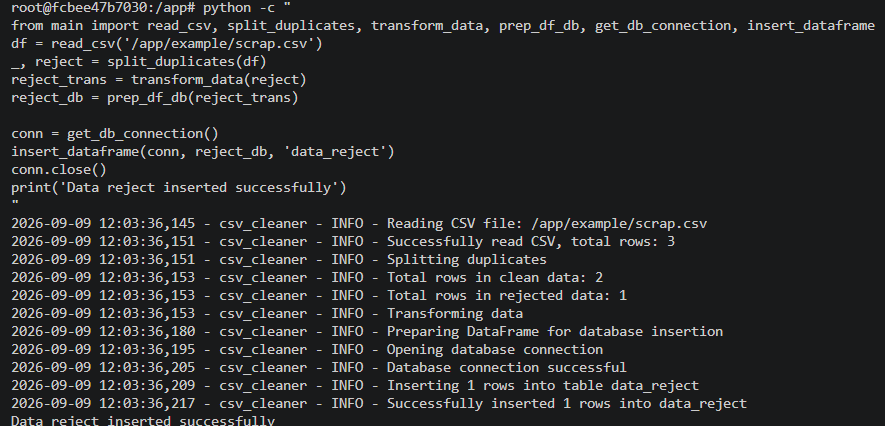
  </p>

* **Test Export JSON & CSV**:
  <p align="center">
    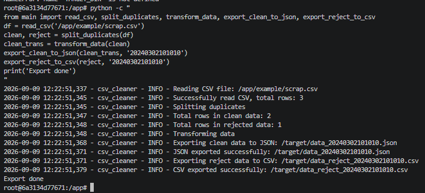
  </p>

---

## 6. Possible Improvements Made
Berikut adalah pengembangan sistem yang telah diterapkan pada *source code* untuk memastikan ketahanan pipeline:
- **Optimasi Pemuatan Data (Bulk Insert)**: Menggunakan iterasi data secara masal (*bulk*) melalui `execute_values` alih-alih perulangan baris-demi-baris yang lambat saat melakukan *insert*, meningkatkan performa eksekusi skrip secara signifikan.
- **Transaction Safety**: Menerapkan manajemen *database connection* melalui blok `try-except-finally`, memastikan *connection pool* selalu ditutup secara aman meskipun skrip dihentikan oleh *fatal error*.
- **Automasi Skema Skalabel**: DDL dieksekusi secara otomatis oleh skrip pada tahap awal menggunakan pembacaan statis `ddl.sql`, sehingga menghindari potensi *error* tabel tidak ditemukan (*table not found*) jika sistem di-*deploy* ulang melalui *scheduler* di kemudian hari.

---
**Candidate Details**
- **Name**: Nur Adiyanto Kusuma Nugraha
- **Role**: Data Engineer